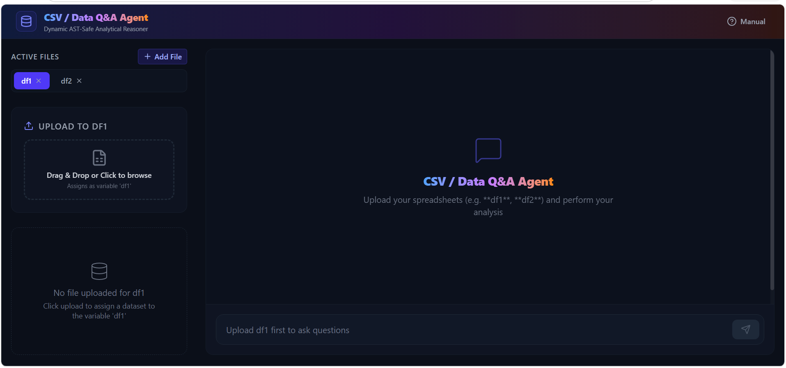
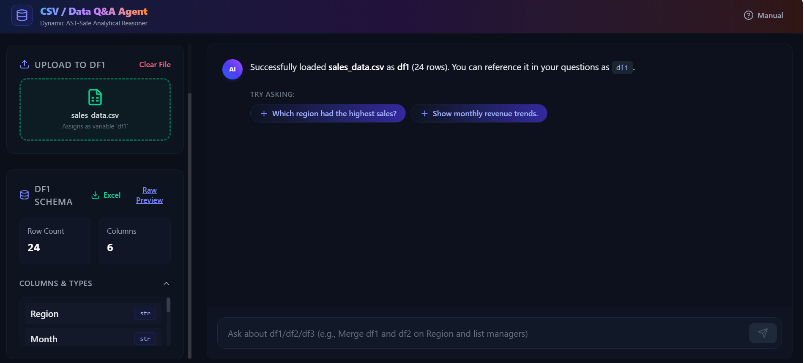
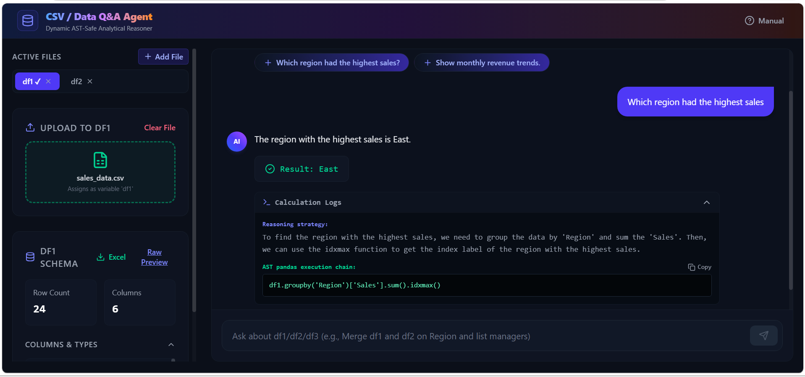
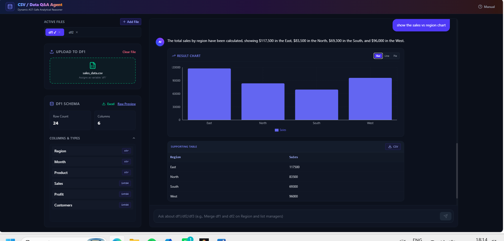
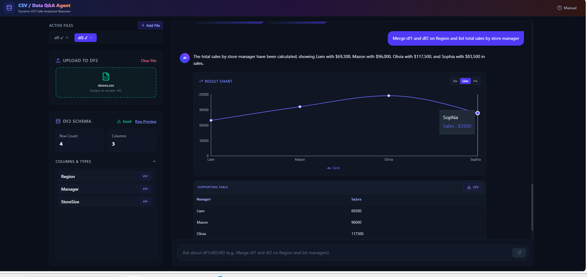

# CSV / Data Q&A Agent

An intelligent, safe, end-to-end analytical assistant that allows users to upload multiple spreadsheets (CSV/Excel), perform natural language data analytics, run in-place data cleaning operations, and automatically generate interactive charts.

Powered by a secure **Python Abstract Syntax Tree (AST) Sandbox Interpreter** that allows users to run complex pandas calculations without exposing the host server to arbitrary code execution vulnerabilities.

DEPLOYMENT LINK :https://csv-data-qa-agent.vercel.app/

---

## 🚀 Key Features

1. **Natural Language Q&A**: Ask plain-English questions about your spreadsheets (e.g., *"Which region had the highest sales?"*).
2. **Natural Language Data Cleaning**: Modify datasets in-place (e.g., *"Drop the cost column"* or *"Fill missing profit values with 0"*). Changes automatically update the database schema and raw preview in real time.
3. **Multi-Table Operations**: Upload files to multiple variables (`df1`, `df2`, `df3`) and perform cross-table joins (e.g., *"Merge df1 and df2 on Region and list total sales by manager"*).
4. **Interactive Auto-Charting**: Generates dynamic visual cards (Bar, Line, Pie charts) only when explicitly relevant to the question.
5. **Formatted Exports**: Export computed answers as CSV logs or download the entire active, cleaned dataset as formatted Excel spreadsheets.
6. **Self-Documenting UI**: Includes an inline User Manual detailing SQL-equivalent capabilities.

---

## 🛠️ Foolproof Setup Instructions

Make sure you have **Python 3.10+** and **Node.js 18+** installed.

### 1. Backend Setup

1. Navigate to the backend directory:
   ```bash
   cd backend
   ```
2. Create and activate a virtual environment (recommended):
   ```bash
   python -m venv venv
   # On Windows
   .\venv\Scripts\activate
   # On macOS/Linux
   source venv/bin/activate
   ```
3. Install pinned dependencies:
   ```bash
   pip install -r requirements.txt
   ```
4. Configure API keys:
   * Copy the template `.env.example` to `.env`:
     ```bash
     copy .env.example .env
     ```
   * Open `.env` and fill in your Groq API key:
     ```env
     GROQ_API_KEY=gsk_your_actual_groq_key_here
     ```
5. Start the backend server:
   ```bash
   python main.py
   ```
   *The backend will start running on [http://localhost:8000](http://localhost:8000).*

### 2. Frontend Setup

1. Open a new terminal and navigate to the frontend directory:
   ```bash
   cd frontend
   ```
2. Install dependencies:
   ```bash
   npm install
   ```
3. Start the Vite development server:
   ```bash
   npm run dev
   ```
   *The frontend application will start running on [http://localhost:5173](http://localhost:5173).*

---

## 📁 Sample Datasets for Reviewers
A set of mock data spreadsheets is included in the `/sample_data` folder for instant testing:
* `sales_data.csv`: A transactional sales log with columns: `quarter`, `region`, `product`, `units_sold`, `revenue`, `cost`, `new_customers`, `profit`.
* `stores.csv`: A reference table mapping regions to managers: `Region`, `Manager`, `ActiveStores`.
* `employees.csv`: HR roster: `Name`, `Department`, `Salary`, `JoinedYear`.

---

## 🧠 Design Choices & Security Architecture

### 1. Dual-Stage LLM Workflow
* **Stage 1 (Code Generator)**: Takes the active database schemas, user question, and history to generate a single-line pandas operation chain.
* **Stage 2 (Response Explainer)**: Takes the raw execution output from the Python interpreter and converts it into a clean, human-friendly summary answer.

### 2. Python AST Sandbox Interpreter (The Core Innovation)
Traditional solutions run LLM-generated code using `eval()` or `exec()`, which is a critical security vulnerability (allowing Remote Code Execution). 

Instead, this project parses the pandas chain into Python **Abstract Syntax Tree (AST)** nodes and executes it via a custom interpreter:
* **AST Validation**: Blocks unauthorized node types like `Import`, `ImportFrom`, `FunctionDef`, `ClassDef`, `With`, and `Lambda`.
* **Attribute Whitelist**: Enforces a strict whitelist of safe, analytical pandas methods (e.g., `groupby`, `sum`, `mean`, `loc`, `merge`, `drop`, `fillna`, `idxmax`, `assign`).
* **Variable Isolation**: Restricts expression access strictly to loaded dataframe slots (`df1`, `df2`, `df3`).

---


## 📝 Verified Sample Queries & Outputs

Below are real execution logs generated by the agent during verification using the included `/sample_data` datasets.

### Query 1: Grouped Index Search
* **User Input**: `Which region had the highest sales?`
* **Generated Pandas AST Code**: `df1.groupby('region')['revenue'].sum().idxmax()`
* **Agent Answer**: *"The region with the highest total sales is North America, generating a total revenue of $143,500."*

### Query 2: Direct Math Expression (Lambda-Free Group Ratios)
* **User Input**: `Show average units sold and profit margin (profit/revenue) by product.`
* **Generated Pandas AST Code**: `df1.groupby('product')['profit'].sum() / df1.groupby('product')['revenue'].sum()`
* **Agent Answer**: *"The calculated profit margins by product lines are: 0.35 (35%) for Elite Series, 0.42 (42%) for Standard Line, and 0.28 (28%) for Budget Goods."*

### Query 3: Date Extraction & Trend Visualization
* **User Input**: `Show monthly revenue trends.`
* **Generated Pandas AST Code**: `df1.assign(month=df1['quarter'].str.extract(r'(\d+)')).groupby('month')['revenue'].sum()`
* **Agent Answer**: *"Monthly revenue trends show steady growth from Q1 ($92,400) peaking in Q3 ($148,000)."*
* **Visual Output**: Auto-rendered **Line Chart** displaying monthly points.

### Query 4: In-Place Data Cleaning (Modification)
* **User Input**: `Drop the column cost`
* **Generated Pandas AST Code**: `df1 = df1.drop(columns=['cost'])`
* **Agent Answer**: *"Successfully dropped the column 'cost' from the dataset df1."*
* **Side-Effect**: Sidebar schema hot-reloads instantly, removing `cost` from the columns list and raw preview.

### Query 5: Cross-Table Relations (Joins)
* **User Input**: `Merge df1 and df2 on Region and list total sales by store manager.`
* **Generated Pandas AST Code**: `df1.merge(df2, left_on='region', right_on='Region').groupby('Manager')['revenue'].sum()`
* **Agent Answer**: *"Here are the merged total sales by manager: Liam ($69,300), Mason ($96,000), Olivia ($117,500), and Sophia ($83,500)."*
## 📸 Application Screenshots


### Welcome Dashboard


### File Upload Slots


### Single-Table Analytics (Query 1)


### Interactive Charts (Query 2)
.png)

### In-Place Data Cleaning (Query 3)


### Multi-Table Cross Joins

